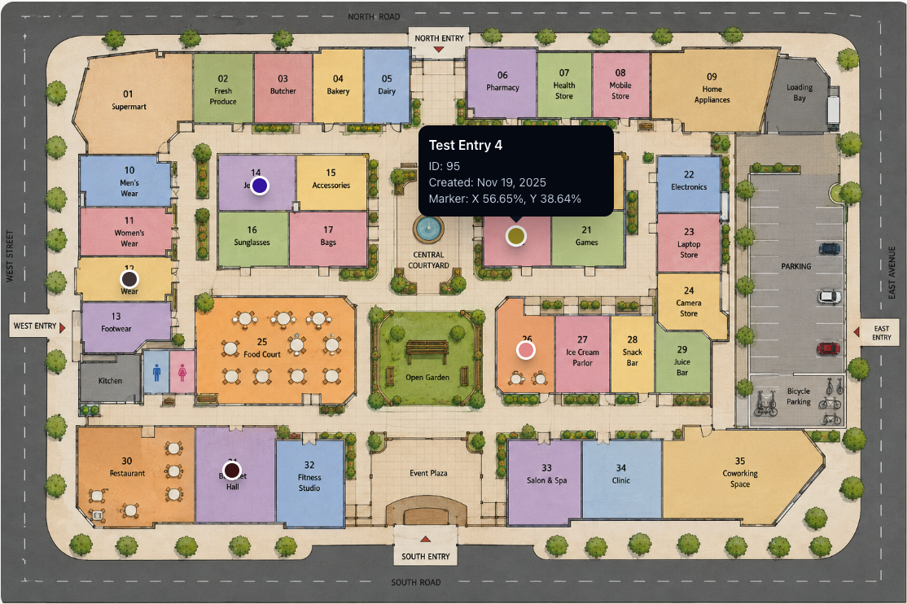

# Twig Usage



## Basic Output

Given a field handle named `entryMapperField`:

```twig



    

    <div class="image-map">
        

        
            <button
                class="image-map__marker"
                type="button"
                style="left: {{ item.marker.x }}%; top: {{ item.marker.y }}%; background-color: {{ item.marker.color }};"
            >
                {{ loop.index }}
            </button>
        
    </div>

```

## Include Related Entry Links

```twig



    

    <div class="image-map">
        

        
            

            
                <a
                    class="image-map__marker"
                    href="{{ relatedEntry.url }}"
                    style="left: {{ item.marker.x }}%; top: {{ item.marker.y }}%; background-color: {{ item.marker.color }};"
                >
                    {{ relatedEntry.title }}
                </a>
            
                <span
                    class="image-map__marker"
                    style="left: {{ item.marker.x }}%; top: {{ item.marker.y }}%; background-color: {{ item.marker.color }};"
                ></span>
            
        
    </div>

```

## Suggested CSS

```css
.image-map {
  position: relative;
  display: inline-block;
  max-width: 100%;
}

.image-map__image {
  display: block;
  width: 100%;
  height: auto;
}

.image-map__marker {
  position: absolute;
  width: 1.25rem;
  height: 1.25rem;
  border: 2px solid #fff;
  border-radius: 50%;
  box-shadow: 0 2px 8px rgb(0 0 0 / 30%);
  transform: translate(-50%, -50%);
}
```

## Accessors

The field value exposes these properties:

```twig
{# Image reference #}
entry.entryMapperField.image.one()
entry.entryMapperField.image.all()
entry.entryMapperField.image.isEmpty()

{# Marker collection #}
entry.entryMapperField.markers.all()
entry.entryMapperField.markers.one()
entry.entryMapperField.markers.count()
entry.entryMapperField.markers.isEmpty()

{# Marker item #}
item.marker.x
item.marker.y
item.marker.color
item.marker.entryId
item.marker.entry.one()
item.marker.entry.all()
item.marker.entry.isEmpty()

{# Eagerly prepare image and marker entries #}

```

## Empty State

```twig



    <p>No image map has been configured yet.</p>

    
    

    {# Render full image map #}

```

## Working With Marker Data

Marker coordinates are numbers from `0` to `100`.

```twig

    Marker {{ loop.index }}:
    X {{ item.marker.x }}%,
    Y {{ item.marker.y }}%,
    Color {{ item.marker.color }},
    Entry ID {{ item.marker.entryId ?? 'none' }}

```

Use `left` and `top` CSS percentages with `transform: translate(-50%, -50%)` to center the marker on its coordinate.

## Global Set Example

If the field is attached to a global set:

```twig



    
    

```

## Example Templates

The plugin includes three Tailwind CDN examples in `example-templates/`:

- `tooltip.twig` - tooltip markers.
- `modal.twig` - modal marker details.
- `info-window.twig` - map-style info windows.

Copy them into your Craft project's `templates/` folder and adjust the routes and field source for your project.
